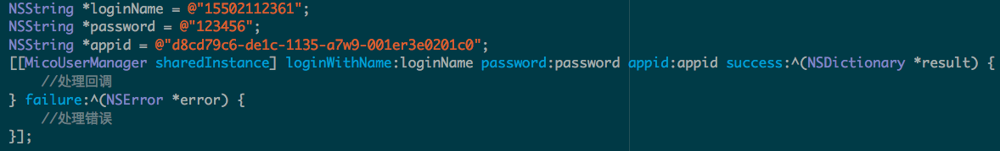
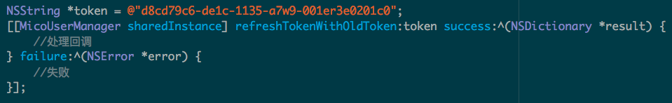
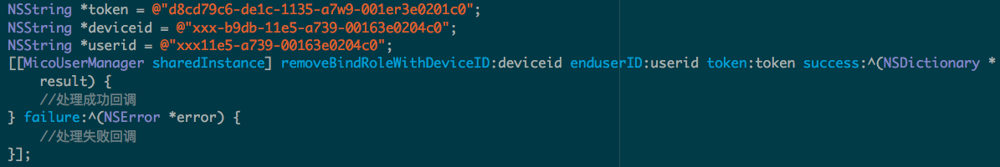

# FogCloud For iOS Native 使用指南

###1. 引入 `FogCloud.framework`, `Others.Bundle`, `EasyLink.a`文件
###2. Pod 安装 `AFNetworking`
###3. 引入头文件，如`#import <FogCloud/MicoUserManager.h>`

</br>
##概述
####想通过APP远程控制一个智能设备，您需要FAE的支持，如果WIFI模块（硬件）已经准备就绪，那么您只需要完成以下几步

#####1、通过Fogcloud平台注册一个APP，得到appid，因为下面需要用到
#####2、对于一个新用户而言，首先需要注册用户，获取验证码、验证验证码、注册登录等，这些都在MiCOUser部分
#####3、注册完成后，我还没有一个可以控制的设备，我需要绑定一个设备，绑定之前需要先让设备连上WIFI路由器，

	1)让设备连上路由器(EasyLink)，
	2)连上以后找到这个设备的IP(SearchDevice)，
	3)绑定它(bindDevice)

###MiCOUser 用户管理
#####基础功能
* [获取验证码](#getVerifyCode)
* [检查验证码](#checkVerifyCode)
* [注册](#register)
* [登录](#login)
* [刷新Token](#refreshToken)

#####权限管理
* [获取用户列表](#fetchMemberList)
* [移除用户权限](#removeBindRole)


<div id='getVerifyCode'>
###*getVerifyCode*
#####params
参数名 | 类型 | 描述
:-----------  | :-------------:| -----------:
loginName     | NSString       | 登录名，邮箱或者手机号
appid         | NSString       | 在Fogcloud平台注册的APP的id

#####代码示例
```
    NSString *loginName = @"wzbdroid@126.com";//也可以为手机号码
    NSString *appid = @"appidappidappidappid";
    [[MicoUserManager sharedInstance] getVerifyCodeWithLoginName:loginName andAppid:appid success:^(NSDictionary *result) {
        //成功回调
    } failure:^(NSError *error) {
        //失败回调
    }];
```

<div id='checkVerifyCode'>
###*checkVerifyCode*
#####params
参数名 | 类型 | 描述
:-----------  | :-------------:| -----------:
loginName     | NSString       | 登录名，邮箱或者手机号
appid         | NSString       | 在Fogcloud平台注册的APP的id
vercode		  | NSString 		| 邮箱或者手机收到的验证码

#####代码示例 
```
	NSString *loginName = @"wzbdroid@126.com";//也可以为手机号码
    NSString *appid = @"appidappidappidappid";
    NSString *vercode = @"478966";
    [[MicoUserManager sharedInstance] checkVerifyCodeWithLoginName:loginName vercode:vercode appid:appid success:^(NSDictionary *result) {
        //处理成功回调，例如
        self.tokenLabel.text = result[@"token"];
    } failure:^(NSError *error) {
        //处理失败回调
    }];
```

<div id='register'>
###*register*

#####params
参数名 | 类型 | 描述
:-----------  | :-------------:| -----------:
password1     | NSString       | 用户密码
password2     | NSString       | 用户密码，确认用
appid         | NSString       | 在Fogcloud平台注册的APP的id
token		  | NSString		| 检查验证码返回的 token

#####代码示例
```
	NSString *token = @"xxx...";
    [[MicoUserManager sharedInstance] registerUserWithPassword:@"123456" confirmPassword:@"123456" appid:APP_ID token:token success:^(NSDictionary *result) {
        //处理成功回调
    } failure:^(NSError *error) {
        //处理失败回调
    }];
```

<div id='login'>
###*login*

#####params
参数名 | 类型 | 描述
:-----------  | :-------------:| -----------:
loginName     | NSString       | 登录名，可以是邮箱或者手机号
password      | NSString       | 用户密码
appid		  | NSString		| 在 Fogcloud 平台注册的 app 的 id

#####代码示例


<div id='refreshToken'>
###*refreshToken*
#####params
参数名 | 类型 | 描述
:-----------  | :-------------:| -----------:
token         | NSString       | 本地持久化的 token
#####代码示例


<div id='fetchMemberList'>
###*getMemberList*
#####params
参数名 | 类型 | 描述
:-----------  | :-------------:| -----------:
token         | NSString       | 本地持久化的 token
deviceid	  |	NSString 		| 设备的 id
#####代码示例


<div id='removeBindRole'>
###*removeBindRole*
#####params
参数名 | 类型 | 描述
:-----------  | :-------------:| -----------:
token         | NSString       | 本地持久化的 token
deviceid	  |	NSString 		| 设备的 id
userid		  | NSString		| 欲移除权限的用户的 id

#####代码示例
